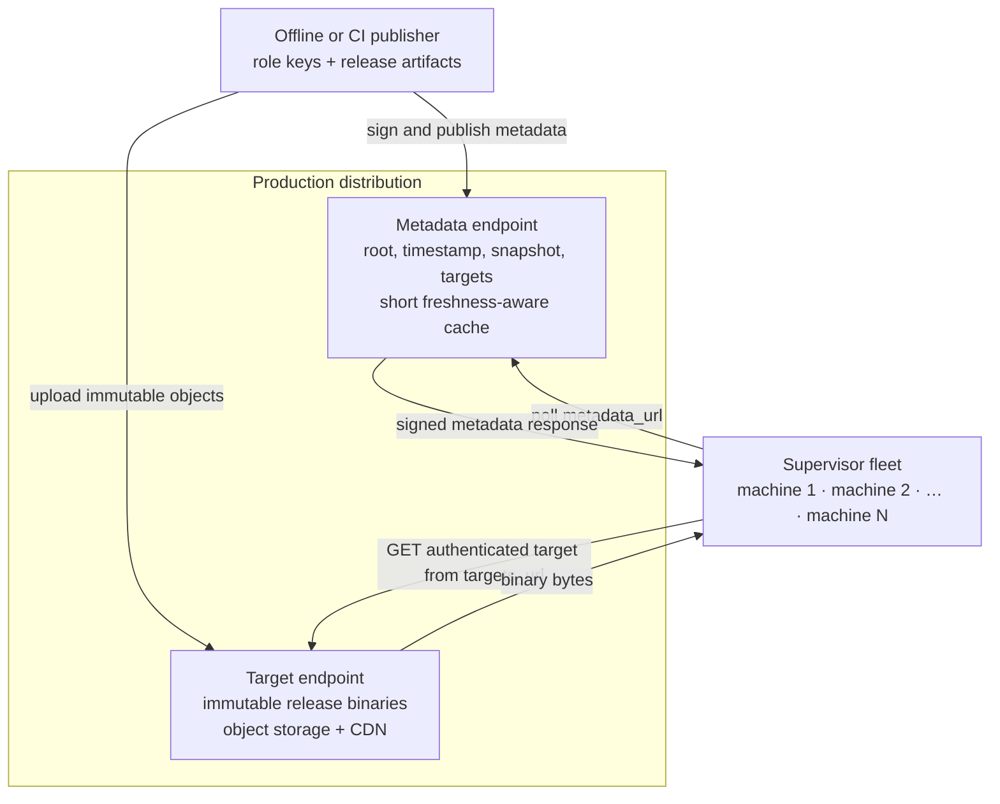
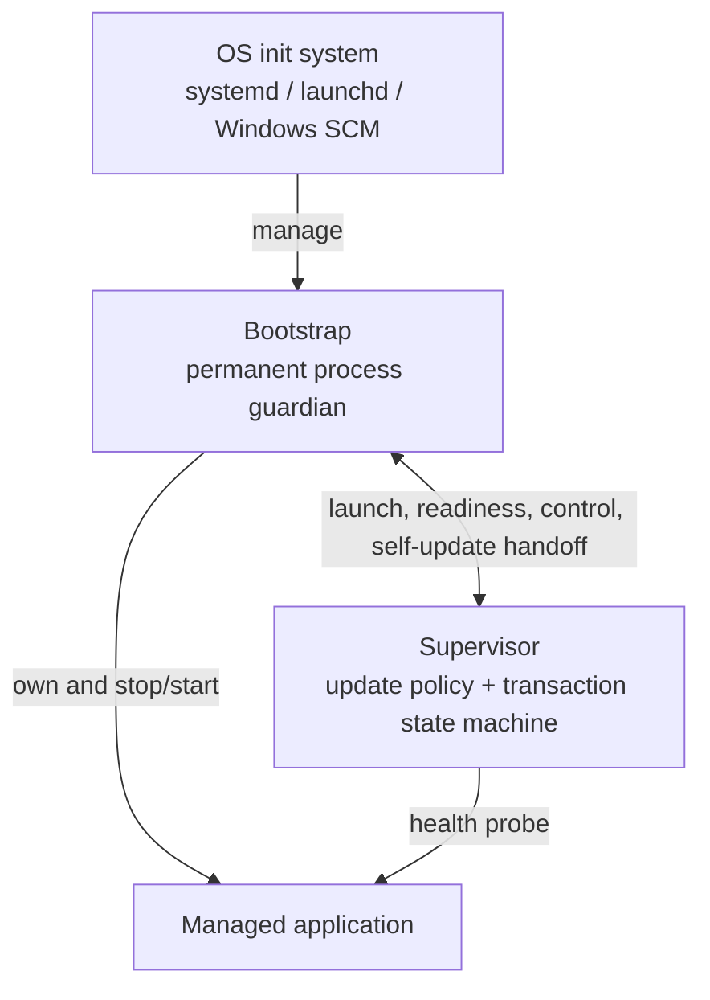
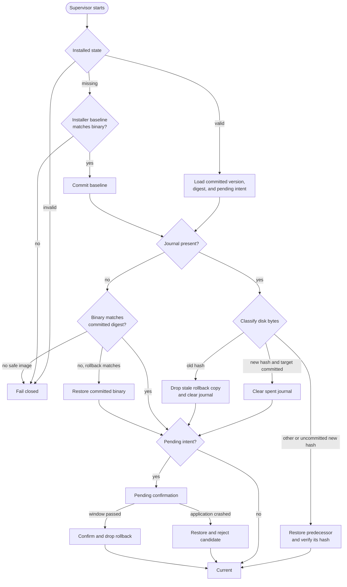
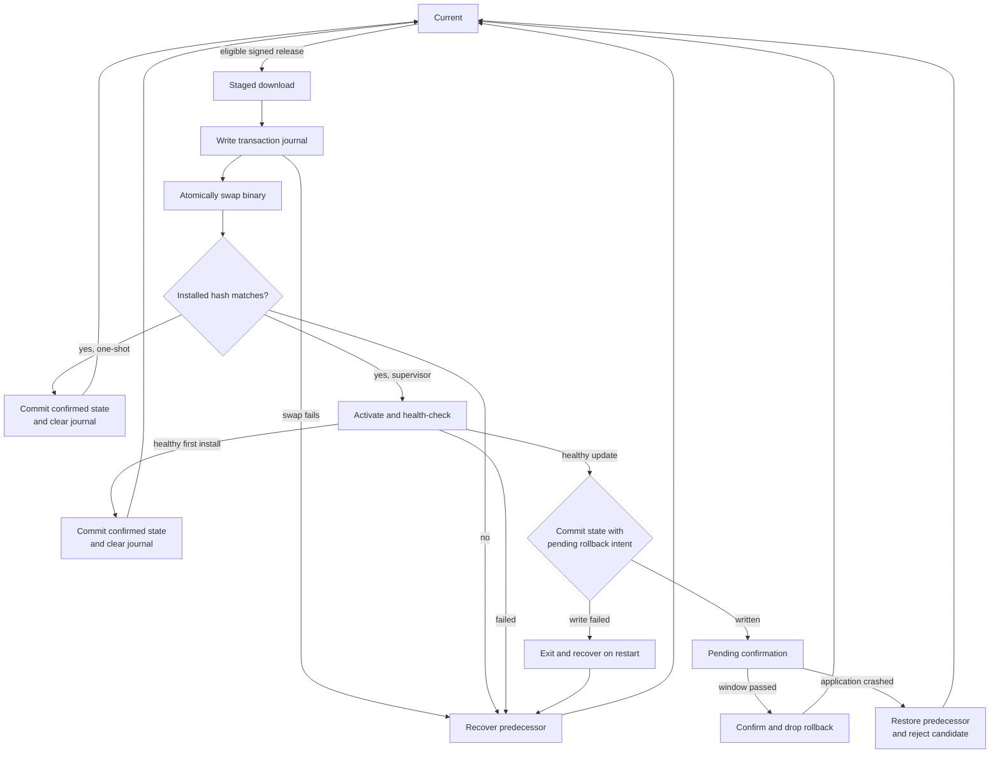
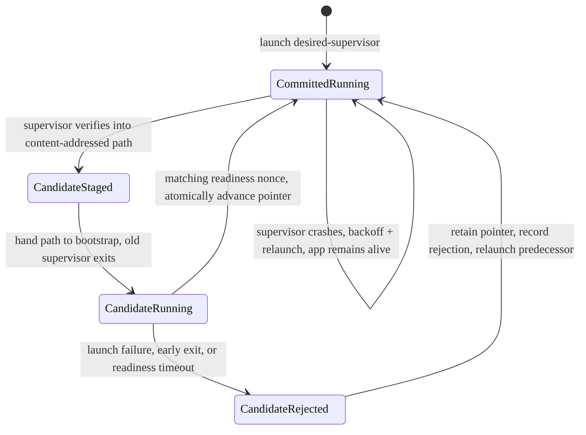

# updated — reliable update infrastructure

[](https://github.com/evan-hines-js/updated/actions/workflows/ci.yml)
[](LICENSE)

`updated` is a small, production-oriented update daemon for Linux, macOS, and
Windows. It keeps arbitrary, update-unaware executables current with a simple
operational model: publish once, let each daemon verify and apply independently,
and automatically recover or roll back when an update cannot be trusted or run.
Its supervisor installs releases from a signed
[TUF](https://theupdateframework.io/) repository — authenticating the full
metadata chain, streaming the platform target with hash/length verification,
replacing the managed executable through a durable transaction, and rolling back
when the new process fails its health check. The managed program does not need to
know how the update protocol works.

The supervisor is itself replaceable without interrupting the application. A small,
network-free bootstrap permanently owns the application, readiness-gates a
content-addressed supervisor candidate, and retains the previous committed pointer
when a candidate cannot start.

> [!IMPORTANT]
> The update, rollback, self-update, and crash-recovery paths are exercised
> end-to-end on Linux, macOS, and Windows. The project is still pre-1.0, so its API,
> configuration, and on-disk formats may change; pin a release and review the
> [trust model](#trust-model) and [current limitations](#current-limitations) for
> your deployment.

## Try it

You need a recent stable Rust toolchain. Run the complete local system—including a
real signed TUF repository, unattended upgrades, broken-release rollback,
supervisor self-update, re-adoption, and crash injection at every transaction
boundary—with:

```sh
cargo run -p e2e
```

Exit code 0 means every scenario passed. The harness writes disposable state under
`target/e2e-work/`.

For an actual installation, build the client binaries and start the bootstrap—not
the supervisor—under systemd, launchd, or Windows SCM:

```sh
cargo build --release -p bootstrap -p supervisor
```

See [deploy/README.md](deploy/README.md) for service layouts and
[deploy/config.toml](deploy/config.toml) for the complete configuration. The
`server` crate is a development publisher/server; production repositories should be
published to object storage or a CDN.

## Deployment topology

A deployment normally has many independent update daemons, one on each managed
machine, reading one logical TUF metadata repository. “One” here means one
consistent signed metadata namespace, not one process or one server. The supervisor
periodically polls `metadata_url` to refresh that signed state. Only when it selects
an eligible release does it fetch the corresponding object beneath `targets_url`.

Metadata and target delivery are separate planes. Metadata is small and
freshness-sensitive; release binaries are large, immutable, and safe to cache for a
long time. They therefore usually use separate origins or CDN behaviors in
production, even though a small installation may serve both URL prefixes from one
bucket or hostname.



The metadata endpoint can be static object storage, a CDN, or an API backed by
either; this implementation does not require a bespoke metadata service. It does
**not** return arbitrary executable URLs. Signed TUF metadata names each target
and authenticates its length, digest, and release
attributes. Each installation is provisioned with a trusted root plus
`metadata_url` and `targets_url` base URLs; the daemon verifies metadata first,
selects a target, and resolves that authenticated target name beneath
`targets_url`. A load balancer, geo-DNS, or CDN can fan either base URL out to as
many replicas as needed. Those delivery systems need to be available, but they do
not need to be trusted with release authority: modified bytes, forged metadata,
expired metadata, and metadata rollback are rejected locally.

Signing keys remain in the offline/CI publisher and never reach either origin, a
CDN, or a deployed daemon.

## Local and mocked components

The repository includes compact stand-ins for the external infrastructure so the
entire topology can be run locally without cloud services:

- `server init` and `server publish` are a development TUF publisher. They create
  real role keys and real signed metadata, but are intentionally simple CLI tools,
  not a production signing service or key-management system.
- `server serve` is the mock metadata origin and binary CDN. It serves the signed
  repository directory over HTTP, deliberately collapsing both delivery planes
  into one process for local development, smoke tests, and system validation. In
  production, publish that directory to hardened object storage and CDN
  infrastructure with appropriate cache policies for each URL prefix.
- `sampleapp` is an update-unaware mock application with controllable health,
  crash, and reload behavior. It proves that managed applications do not
  need updater-specific code.
- `e2e` assembles disposable instances of those components and drives real daemon
  processes through upgrades, rollbacks, self-update, trust failures, and crashes.
  Unit tests also use in-memory process/store doubles for deterministic fault
  injection; deployed binaries use the filesystem and OS process implementations.

## Guarantees exercised in CI

- TUF root rotation, expiry, rollback protection, and target hash/length verification
- Fail-closed rejection of a tampered root, drifted binary, or corrupt candidate
- Durable application commit-or-rollback recovery at every transaction boundary
- Health-gated application rollback and post-commit confirmation
- Readiness-gated supervisor pointer replacement with rollback
- Same-PID application re-adoption after supervisor crash or self-update
- Instance locking and persisted rejection of bad releases
- Zero-downtime same-PID reload under load on Unix
- Native Windows Service Control Manager lifecycle coverage

## Documentation

- [Deployment guide](deploy/README.md)
- [Reference configuration](deploy/config.toml)
- [Trust model](#trust-model)
- [Current limitations](#current-limitations)

## Operating model

- A real TUF client: root/targets/snapshot/timestamp verification, sequential
  root rotation, metadata freshness and version-rollback protection, and
  threshold signing — via the mature [`tough`](https://crates.io/crates/tough)
  library rather than a hand-rolled verifier
- Targets selected by a logical path convention
  (`products/<product>/<channel>/<version>/<os>-<arch>/<component>`) with signed
  custom metadata, so one repository serves many products and platforms
- A *capability*-typed download: bytes stream to disk only after the metadata
  chain verifies, with hash/length checked while streaming
- Downgrade refusal and platform matching as a post-authentication policy
- An external supervisor that can update an otherwise update-unaware program
- A durable stop → swap → health-check → commit-or-rollback install transaction,
  recovered deterministically after a crash at any boundary
- A supervisor that also updates itself (its own TUF product target) by staging
  the new version into content-addressed storage and letting a tiny, installer-owned
  **bootstrap** activate it only after it proves it can run — so a supervisor that
  cannot execute at all falls back to the previous committed path instead of bricking
- Crash-safe recovery: the permanent guardian retains the application while a
  restarted supervisor re-adopts it through the control channel
- The same primitives repackaged for a program that is *not* a daemon: an
  `updated-oneshot` mode that verifies and swaps in the newest release at launch
  and then `exec`s the program — no supervision loop, for CLIs and batch jobs
- A production-shaped local validation environment, including signed metadata,
  immutable artifacts, healthy and broken application releases, and a supervisor
  candidate that cannot execute

The supervisor deliberately runs the update from outside the managed application.
This avoids asking the *application* to overwrite itself and makes it independent
of the update protocol. The supervisor's *own* replacement is gated the same way,
one level up: it never overwrites its running image, but stages a candidate whose
path the bootstrap commits atomically only once the candidate has proven itself.

## Design decisions

The load-bearing design choices are documented here so operators can evaluate the
system rather than infer its guarantees from implementation details.

**Is the program being updated one we can modify to update itself, or an arbitrary
binary?**
Assumed arbitrary and update-*unaware*. So the updater is an external *supervisor*
that wraps any executable; the managed program needs no cooperation. (A server can
optionally opt into a zero-downtime reload, but nothing requires it.)

**Who updates the updater — isn't it turtles all the way down?**
Assumed the hierarchy must terminate at something we neither ship nor have to keep
current: the OS init system (systemd / launchd / Windows SCM). Just above it sits a
tiny, installer-owned **bootstrap** — the one binary we ship that the init system
manages. It does the absolute minimum (own the application, launch the committed
supervisor pointer, and advance it only after a staged replacement proves ready)
and speaks no network or TUF, so it should never itself need updating — which is
what lets the chain terminate rather than sprout another self-updating turtle. The
supervisor updates the application and stages its own next version; the bootstrap
performs the supervisor swap, because a supervisor that cannot execute at all
cannot recover itself.

**How should updates be authenticated?**
Assumed real [TUF](https://theupdateframework.io/) rather than a bespoke signature
scheme — pinned root, four roles, one-version-at-a-time root rotation, metadata
freshness, and rollback protection — built on the mature `tough` library so the
security-critical verification isn't hand-rolled.

**Does "seamlessly replaced" mean zero downtime?**
Assumed a brief, health-gated restart (stop → swap → start) is fine for most
programs. Zero-downtime is an opt-in reload — the server re-execs in place, keeping
its listening socket — for programs that support it; the e2e proves it drops no
requests under load.

**Must the application stay up when the *supervisor* restarts (crash or
self-update)?**
Assumed yes. The bootstrap owns the app across supervisor generations; a replacement
supervisor re-adopts the guardian-owned PID through the inherited control channel,
so a supervisor crash or self-update is invisible to it.

**How do we know a new version is actually good before committing to it?**
Assumed a health check — an HTTP readiness probe bound to the launch by a per-launch
token, or process liveness where there's no endpoint. Commit only on success;
otherwise roll back to the previous version and remember the release as rejected.

**What if the machine crashes mid-install?**
It must recover from a process or ordinary OS crash. A transaction journal records
the swap; on startup the supervisor reconciles from the on-disk hash and either
finishes or reverses the update — exercised at every transaction boundary in the
e2e. Unix fsyncs the containing directories so the ordering survives sudden power
loss; Windows lacks an equivalent directory fsync here, so an abrupt power loss at a
narrow commit boundary could lose a just-created or just-deleted journal entry. Even
then, atomic replacement never installs a torn file and the signed hashes keep any
inconsistent surviving state fail-closed rather than silently trusted.

**Can an attacker force a downgrade to a known-vulnerable version?**
Assumed no. Application downgrades are refused by release policy, and
TUF's metadata versioning independently prevents rolling repository metadata backward.

**Where does signing happen, and what runs on the client?**
Assumed offline/CI signing. Role keys never touch a client. Metadata origins,
object storage, and CDNs serve only pre-signed metadata and immutable target
objects; deployed machines run only the bootstrap, supervisor, and managed
application.

**Which platforms and architectures?**
Assumed Windows, macOS, and Linux on x86-64 and aarch64. Targets are selected by
`<os>-<arch>` from signed metadata, and CI builds and runs the whole end-to-end
suite on all three operating systems.

**How is the very first version trusted?**
Assumed the installer places the initial binary, pins the TUF root, and embeds its
baseline version plus exact SHA-256 — the one out-of-band step, after which the system is
self-sustaining.

**Can the supervisor run without the bootstrap?**
No. The bootstrap is the supervisor's required process owner and safe replacement
boundary. It always checks the reserved `supervisor` product on the application's
channel and hands verified candidates to the bootstrap for readiness-gated activation.

## Architecture



This host view intentionally omits repository distribution, which is covered by
the topology above. The bootstrap owns process lifetime; the supervisor owns
networking, release policy, health decisions, and durable update transactions.
Keeping those responsibilities separate lets the supervisor crash or replace
itself without taking down the managed application.

The crates have narrow responsibilities:

| Crate | Responsibility |
| --- | --- |
| `updated-tuf` | The async TUF client (load pinned root, refresh, find + download verified targets), the offline repository builder (mint/sign root, publish releases), the default platform + downgrade policy, and release **selection** (`select`: the newest eligible target, shared by the supervisor and one-shot) |
| `updated` | Post-verification core shared across the tower: the durable transaction journal and recovery/binary classifiers (`transaction`), crash-safe filesystem replacement (`apply`), atomic installed state with pending rollback intent (`state`), instance locking, CSPRNG tokens, file digests, health constants, logging, rejection tracking, and the shared operator-config loader + path resolver |
| `control` | Frozen, std-only bootstrap⇄supervisor protocol and capability negotiation |
| `bootstrap` | The installer-owned permanent guardian: own the application, run the committed supervisor, readiness-gate a staged replacement, and atomically advance the supervisor pointer. No network, TUF, or release policy |
| `supervisor` | Periodic TUF refresh and selection, application update planning/transactions, health policy, durable state, rollback decisions, and staging its own next version for the bootstrap |
| `updated-oneshot` | Optional update-on-launch shell for a CLI, batch job, or on-demand tool. It uses the same journaled swap, recovery classifier, drift policy, and installed-state format, then commits directly to confirmed state and `exec`s — no supervision loop, health gate, confirmation window, or bootstrap |
| `server` | Development TUF publisher (`init`/`publish`) and static repository server (`serve`) — the mock CDN |
| `sampleapp` | An update-unaware HTTP service used by the end-to-end demo |
| `e2e` | One cross-platform Rust harness that stands up a TUF repository and drives the full update, self-update, crash-recovery, and TUF/hardening scenarios |

## Trust model

Trust is anchored by [TUF](https://theupdateframework.io/). The installer pins a
**root** metadata file; the root delegates authority to the `targets`, `snapshot`,
and `timestamp` roles, each with its own key(s) and threshold. Every refresh:

- rotates the root **one version at a time** from the pinned root, so key
  compromise is recoverable by a signed root that revokes and replaces keys;
- verifies `timestamp` → `snapshot` → `targets`, enforcing that metadata versions
  **never decrease** (rollback protection) and are not **expired** (freshness);
- authenticates each target's length and SHA-256, checked again while the bytes
  stream to disk — no target executes unless the complete chain verified.

The private role keys stay offline on the publisher; `snapshot`/`timestamp` may
use shorter-lived automation keys. A compromised mirror or network attacker cannot
forge an accepted release, roll a client back to an old version, or freeze it on
stale metadata past expiry.

Target paths, sizes, and hashes are always derived from verified metadata, never
from unsigned application input; the operator-configured `targets_url` supplies
only the distribution base. A [`VerifiedTarget`](crates/updated-tuf/src/lib.rs) is
a capability produced only after verification, so the download path cannot be
handed unauthenticated target attributes. Errors are classified **retryable**
(transport) vs **fail-closed** (trust) — a trust failure never silently retries or
falls back.

**On TLS.** TUF metadata provides authenticity, integrity, freshness, and rollback
protection independent of the transport, so HTTPS is not what trust rests on. It is
still worth using for public distribution — it adds **confidentiality** (hiding
which, possibly vulnerable, version a host fetches) and defense in depth — and the
client speaks it out of the box (`rustls`); use `https://` metadata/targets URLs.

**Local state.** A local administrator remains inside the host trust boundary.
Signed TUF metadata detects tampering, but ordinary state files are not monotonic
storage; rollback resistance against a local administrator needs platform-backed
storage and is out of scope here.

**Managed-program boundary.** The reference deployment runs the supervisor and
managed program as the same unprivileged OS account. The managed program is
therefore inside the updater's local trust boundary: TUF protects against a
compromised repository or transport, not against code already running with the
updater's filesystem permissions. Deployments that must contain a hostile managed
program need OS-level isolation (a separate identity or sandbox plus narrowly
scoped IPC), outside this compact reference implementation.

## Dependencies

The trust logic is the security-critical core, so rather than hand-roll a TUF
verifier we build on [`tough`](https://crates.io/crates/tough), the mature TUF
client/editor library (used by Bottlerocket). That is a deliberate trade: a
**larger trusted computing base** — `tough` is async and pulls in Tokio,
`rustls` + `aws-lc-rs`, and `reqwest` — in exchange for battle-tested metadata
verification, root rotation, and rollback/freshness checks that are precisely the
things a from-scratch implementation gets subtly wrong. The supervisor leans into
async (`#[tokio::main]`) rather than wrapping it.

Key crates the deployed client links:

| Dependency | Category | Why it's needed |
| --- | --- | --- |
| `tough` | TUF | The whole trust path: metadata verification, root rotation, target download |
| `aws-lc-rs` | crypto | The one crypto library: SHA-256 (install-time drift hash), Ed25519 (via `tough`), and role-key generation for the publisher |
| `tokio` | runtime | Async runtime the TUF client requires |
| `reqwest` + `rustls` | network/TLS | HTTP(S) transport for metadata/targets and the health probe |
| `semver` | version logic | Update gating and downgrade policy |
| `serde` / `serde_json` | (de)serialization | Installed-target and transaction-journal records |
| `hex` | encoding | Hex-encoding hashes on disk (the state/journal records) |
| `libc` (Unix) / `windows-sys` (Windows) | OS | Process groups/signals and descriptor passing (Unix), Job Objects, services, and process control (Windows) |

The `sampleapp` fixture is test scaffolding, not part of the trust base.

## Development and testing

### Requirements

- A recent stable Rust toolchain — and nothing else. The end-to-end harness is a
  Rust program (`crates/e2e`), not a shell/PowerShell pair, so it runs identically
  on Linux, macOS, and Windows.

Run the test suite:

```sh
cargo test --workspace
```

Run the complete end-to-end system validation — the same binary on every OS:

```sh
cargo run -p e2e
```

It builds the release binaries, stands up a real TUF repository, then drives real
scenarios against it: an unattended application upgrade, health-gated rollback of
a broken release, supervisor self-update, crash recovery at every transaction
boundary, and hardening/TUF fail-closed cases (a tampered pinned root, a drifted
binary, the instance lock, persisted rejection). On Unix it also verifies a
zero-downtime reload under load. Work files are written under `target/e2e-work/`;
exit 0 means every scenario passed.

The harness owns fixed localhost ports and the shared `target/e2e-work/` tree.
Run only one E2E instance per checkout at a time; concurrent instances intentionally
do not coordinate and will interfere with each other's services and durable state.

## Manual usage

Build the development publisher and client tower:

```sh
cargo build --release -p server -p bootstrap -p supervisor
```

Initialize a TUF repository — this mints the four ed25519 role keys and signs an
empty repository:

```sh
target/release/server init --repo ./repo --keys ./keys
```

Publish a release. Targets are declared per platform as `<os>-<arch>=<path>`; the
server records them under `products/<product>/<channel>/<version>/<os>-<arch>/…`:

```sh
target/release/server publish --repo ./repo --keys ./keys \
  --product app --version 1.0.0 \
  --target linux-x86_64=./app-linux-x86_64 \
  --target linux-aarch64=./app-linux-aarch64 \
  --target macos-aarch64=./app-macos-aarch64 \
  --target windows-x86_64=./app-windows-x86_64.exe
```

Serve the repository through the local metadata/target origin:

```sh
target/release/server serve --repo ./repo --addr 127.0.0.1:8080
```

Install an initial supervisor, then start the bootstrap against it. The supervisor
pins the config's `root`, refreshes the
metadata chain, and installs the newest `app` target for this platform. All
configuration — repository, application command, policy, timeouts — lives in one
TOML file (`updated::config`; see `deploy/config.toml`). Bootstrap ownership paths
stay explicit command-line arguments:

```sh
mkdir -p ./deploy/state
cp ./target/release/supervisor ./deploy/supervisor
```

The equivalent Windows layout uses `supervisor.exe`; the deployment guide contains
the native service setup.

```toml
# repo-test.toml
[repository]
root         = "./repo/metadata/root.json"
metadata_url = "http://127.0.0.1:8080/metadata/"
targets_url  = "http://127.0.0.1:8080/targets/"

[application]
product         = "app"
current_version = "1.0.0"
current_sha256  = "<sha256 of ./deploy/app>"
command         = ["./deploy/app", "--your-app-argument", "value"]
health_url      = "http://127.0.0.1:9090/healthz"

[timeouts]
check_interval = "15s"
```

```sh
target/release/bootstrap \
  --state-dir ./deploy/state \
  --supervisor-config ./repo-test.toml \
  --supervisor ./deploy/supervisor \
  --ready-timeout 60
```

The bundled server is local infrastructure for development and testing. A
production deployment publishes the versioned TUF metadata and immutable target
objects through HTTPS object storage or a CDN, and keeps the offline role keys off
every client.

## Mechanisms and state machines

| Mechanism | What it guarantees |
| --- | --- |
| Installer baseline | With no installed state, both modes require a configured SemVer + SHA-256 pair, match it against the local executable, and atomically commit it before execution. Missing or mismatched provisioning fails closed and does not require network access. |
| TUF refresh | A pinned root authenticates timestamp → snapshot → targets; expiry and metadata-version checks resist freeze and rollback attacks. |
| Selection policy | Targets are ordered by SemVer, newest first. Only the configured product/channel and local OS/architecture are eligible; the current version and rejected hashes are skipped. Versions below the installed version are refused. |
| Verified download | `tough` streams to a staging file with signed length and SHA-256 checks; the installed bytes are hashed again before execution. |
| Crash-recoverable replacement | A flushed journal and rollback copy precede the atomic rename. Startup compares hashes and either confirms the commit or restores the old binary. Unix also fsyncs directory entries; see the Windows power-loss qualification above. |
| Health gate | A process must remain alive or answer HTTP readiness with a per-launch token. Reload mode must also report the signed candidate version. |
| Pending confirmation | A newly committed application retains its previous image; one crash within the window restores and rejects the candidate. |
| Process adoption | The bootstrap owns the application and lets replacement supervisors adopt its current PID through the authenticated control channel. |
| Supervisor pointer | The bootstrap runs `desired-supervisor` and readiness-gates content-addressed candidates, so even a binary that cannot start rolls back. |

The application transaction is recoverable from a process crash at every durable
boundary (with the Windows sudden-power-loss qualification above). Recovery runs
before release selection or application launch:



Once boot recovery reaches `Current`, an update follows a separate, smaller
transaction. The journal is written before the executable changes, and the signed
digest is checked again after the swap:



`Pending` is durable, not an in-memory timer. The installed-state record and the
predecessor image remain intact until confirmation succeeds. While pending, the
supervisor suppresses new updates so a second transaction cannot overwrite the only
rollback image. One-shot mode has no resident process to observe, so it commits a
verified update directly to confirmed `Current` before executing the program.

### Release selection

The repository is a set of signed targets, not a mutable “desired version” slot.
For each refresh the client sorts matching targets by SemVer, newest first, skips
the currently installed version and hashes temporarily rejected after a failed
health check, and installs the first candidate authorized by policy.

Reaching the first release below the installed version ends selection: every
remaining target is older too. Application downgrades are not currently supported.
A durable fleet rollback needs a signed desired-version or pinning mechanism; merely
allowing every older target is ambiguous and can oscillate back to the highest SemVer.
Until that intent is represented safely, use a new forward-moving release version
containing the previous known-good code.

### Supervisor self-update state machine

The supervisor cannot safely overwrite itself, so the installer-owned bootstrap
terminates the update chain. It has no network or release-selection logic:



During a supervisor swap the application remains alive. The replacement supervisor
adopts the guardian-owned application before signalling readiness. The bootstrap
keeps no pending activation journal: it advances `desired-supervisor` only after
readiness succeeds, so a bootstrap restart naturally relaunches the last committed path.

### macOS smoke test

For production-shaped local macOS validation, `scripts/macos-smoke.sh publish
<version>` waits for the requested application version without treating supervisor
log messages as a control protocol. It checks the live version and fails immediately
when asked to publish a version below the running version. Downgrades are not supported.

After starting the smoke tower, `scripts/macos-publish-fuzz.sh` concurrently publishes
bursts of three or four fresh random versions. It continues as soon as the application
selects the greatest published version, completing as many bursts as possible in one
minutes and allowing the last started burst to finish. Every burst has a 30-second
convergence timeout, and every burst is generated above the preceding maximum so each
successful check represents a real upgrade. Each burst also publishes a corrupt executable
above its valid releases, requiring guardian restart, recovery rejection and rollback
before selection of the greatest valid version. The smoke tower's check interval, health
grace, confirmation window, guardian process-stop grace, and launchd restart throttle are
configurable with `UPDATED_SMOKE_*` variables so CI can exercise this realistic path
rapidly. The fuzzer fails immediately if more than 30 consecutive availability probes fail.
Fuzz duration, timeout, batch-size range, availability limit, and version-major prefix are
configurable through `UPDATED_SMOKE_FUZZ_*` variables.

### Durable state files

The important files are all atomically written beside the configured state or
inside the bootstrap `--state-dir`:

| State | Purpose |
| --- | --- |
| `*.installed` | committed application version/digest plus optional pending rollback intent |
| `*.transaction` / `*.old` | in-flight application transaction and rollback image |
| `*.rejected` | failed digests, aged out after `retry_after` |
| `*.apptoken` | current application launch's health token |
| `desired-supervisor` | guardian's atomically committed supervisor path |
| `app-crashed` / `rejected-supervisor` | one-shot guardian markers consumed by the supervisor |
| `supervisors/<content-id>/` | verified supervisor candidates staged by content hash |

### Restart strategies

The portable default is stop → swap → start. On Unix, `application.reload_command`
may instead trigger a same-PID re-exec that preserves listening sockets. It receives
`UPDATED_CHILD_PID` and `UPDATED_BINARY`; `application.health_url` is required,
and readiness must echo both the launch token and `X-Updated-Version`. Commands
that fork or hand off to another PID are unsupported.

Production deployments run `bootstrap --state-dir ... --supervisor-config ... --supervisor ...` under
systemd, launchd, or Windows SCM. Direct supervisor execution is rejected, and
supervisor replacement is always part of the managed update loop.

## Current limitations

- The demo uses a single top-level `targets` role; per-product/channel delegated
  roles (which `tough` supports) are a straightforward extension left undone here.
- Local installed-target state is an ordinary file, not monotonic storage.
  TUF's own metadata provides rollback protection over the network, but removing
  both the state and the TUF datastore resets a machine to its configured
  installation baseline. Platform-backed storage is needed for rollback resistance
  against a local administrator.
- The deliberately minimal bootstrap is not updated over the air; its replacement
  belongs to the installer or package manager.
- Zero-downtime reloads are Unix-only (they rely on the server re-execing in
  place); on Windows every strategy is the stop/swap/start restart.
- The dev server serves a repository from disk; production should use object
  storage or a CDN with immutable versioned metadata and conditional timestamp
  replacement. Example systemd, launchd, and Windows SCM integration is under
  `deploy/`, but production packaging remains the deployer's responsibility.

## Security

Keep the TUF role keys off every client. The `root` key is the ultimate authority
and should be offline; `snapshot`/`timestamp` may use shorter-lived automation
keys. Anyone who obtains the signing keys for a role can publish metadata that
role is trusted for.

For security-sensitive use, review the trust model and limitations above before
deployment. Until a dedicated security policy and hardened release process are
in place, please report suspected vulnerabilities privately to the repository
owner rather than opening a public issue with exploit details.

## License

`updated` is available under the [MIT License](LICENSE).
